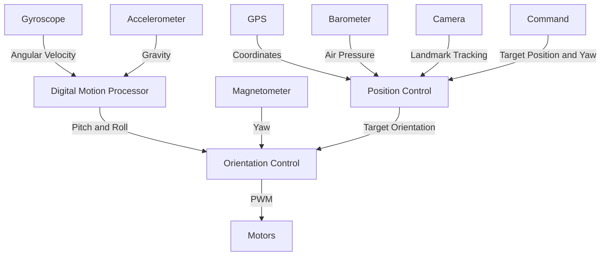

# Quadcopter Proposal

This document outlines the design of a quadcopter. The goal is to build a quadcopter from scratch using open-source software and hardware. The quadcopter will be designed to be modular and easy to upgrade.

## Goal

The goal of this project is to learn about drones, control systems, and aerodynamics. The project will be open-source and will be designed to be modular and easy to upgrade.

This project also looks good on a resume. It shows that you can work in a team, design complex systems, and work with hardware.

It is better to see the drone fail than to not see it at all. The project will be a learning experience and will be a good way to learn from mistakes.

Capital follows ideas. If the project is successful, it can be used to start a business or get funding for a startup. This can be scaled up to a drone delivery service.

## Team

It is best to have constructive opposition in a team. This will allow for more diverse ideas and better decision making. 

> Therefore, ideas written in this document are not final and are open to discussion. Please object them if you think they are not good.

Most of the tasks can be done remotely. During assembly, it can be held at McGill University or Bibliothèque et Archives nationales du Québec (BAnQ). Flight tests can be done in an open field.

Most of the project files will be stored in GitHub repositories. This will allow for easy collaboration and version control. Project Management can be done using GitHub Projects.

## Roles

One person can take multiple roles.

We will need the following roles:
- 2-3 Software Developers (Python, Rust, C++, TypeScript)
- 2-3 Mechanical Designers (FreeCAD, SolidWorks, Fusion 360)
- 1-2 Electronics Designers/Technicians (KiCad, PCB Printing, Soldering)

There will be no project manager/product owner as there are no stakeholders, hence no pressure.

## Timeline

It is going to take a year or two... Let's hope it flies.

## Budget

The budget will be around $200 for the components. Wei is willing fund all of it as long as it is not too expensive.

## Software Components

Most high-level software (flight controller, simulation, base station) will be written from scratch using low-level libraries.

### Flight Controller

If the ESP32 microcontroller is used, the flight controller will likely be written in C++ with PlatformIO or Rust.

#### System Diagram



> The Digital Motion Processor (DMP) is already provided by the MPU chips.

#### Orientation Control

This control loop will be responsible for keeping the drone level and stable using PID controllers. It will have the following:

- Accelerometer and Gyroscope to get pitch and roll
- Magnetometer to get yaw

#### Position Control

This control loop will wrap the orientation control loop and will be responsible for keeping the drone in a specific position using PID controllers. It will have the following:

- Barometer to get altitude
- GPS to get position outdoors
- Camera optical flow for indoor displacement calculation

#### GPS

The accuracy of the GPS is around 3 meters. This is enough for the drone to stay in place outdoors. For more accurate positioning using GPS, RTK GPS (Military GPS) can be used for centimeter accuracy, although it is more expensive (~$200).

#### PID Controllers

All PID controllers have 3 parameters to tune: Proportional, Integral, and Derivative. It will be nice to tune these parameters on the fly using some machine learning techniques such as reinforcement learning.

#### End-to-End Neural Network Control

Although, PID controllers are usually preffered for their simplicity and stability, it would be interesting to try an end-to-end neural network control. This would be a neural network that takes the raw sensor data and outputs the motor commands. This would be a more complex control loop but could potentially be more efficient and stable.

#### Self Calibration

It would be nice to have the drone continuously calibrate itself and eliminate the need for manual calibration and finding those magic constants.

### Camera

#### Optical Flow

This will allow the drone to stay in place in indoor environments without GPS. It will use a camera to track objects and calculate the drone's displacement.

To achieve this, the algorithm will need to track landmarks. Some landmarks may not be actual landmarks, so the algorithm will need to ignore them statistically.

#### Image Capture

This will take pictures and send them to the base station or save them to an SD card.

### Drone Simulation Environment

This will be a physics simulation of the drone and its environment. It will be used to develop and test the control loops efficiently. It will be written in Python using PyBullet as it is physics engine library designed for robotics.

This simulation will need to take into account multiple disturbances such as air turbulence, wind, motor malfunction, sensor noise, sub-optimal center of mass, etc.

If the physical drone has wings, the simulation will need to take into account the aerodynamics of the wings.

> It will make more sense to write the simulator in Rust or C++ to prevent rewriting the flight controller in Python. Although, fast prototyping is easier in Python.

### Base Station

The base station will communicate with the drone. This will likely be another ESP32 microcontroller. This will forward and receive information from a computer using Serial.

#### Base-Station to Drone Communication

If the ESP32 is used, the communication between the base station and the drone will likely be Wi-Fi `802.11 LR` as it can achieve a range of 1 km with line of sight.

#### Computer

The computer will be used to control the drone and receive information from the drone. This software can be based on web technologies such WebSerial and Gamepad API.

## Hardware Components

### Frame

The frame base will likely be made of carbon fiber with 3D printed parts holding the electronics together. The design should be modular to allow for easy upgrades and repairs. One of the upgrades can be adding wings to the drone to increase the flight time.

The following frame idea can be changed. Please suggest your changes.

```
             .....             .....
            .......           .......
           ....P....   /C\   ....P....
            ...|...   /   \   ...|...
             ..|..    |   |    ..|..
   +-----------+------+---+------+-----------+
  /      Wing  |      Frame      |  Wing      \
 /       Ext.  |      Wing       |  Ext.       \
+--------------+------+---+------+--------------+
             ..|..    | A |    ..|..
            ...|...   \___/   ...|...
           ....P....         ....P....
            ...|...           ...|...
             ..|..             ..|..
               +-----------------+
               |   Stabilizer    |
               +-----------------+
```
- The Wing Extension and the Stabilizer can be detached.
- The Frame Wing can also be detached to save weight.
- P denotes a propeller. They have a diameter of around 12 centimeters.
- A denotes the antenna. It will be pointed downwards and be part of the landing gear.
- C denotes the camera.

> The antenna is pointed downwards as the radiation pattern of the standard antenna is like a donut around the wire. If the antenna was pointed sideways, a lot of power will be wasted by radiating to the sky.

#### 3D Printing

The wings will likely be 3D printed with LW-PLA. There is a 18 cm<sup>3</sup> 3D printer readily available. A 25 cm<sup>3</sup> is available at McGill University and Bibliothèque et Archives nationales du Québec (BAnQ).

The Gyroid infill pattern will be used to save weight. The Gyroid infill pattern is a very strong infill pattern that is also very light.

#### Cadding

FreeCAD has a add-on to very quickly create airfoils using [Airfoil Tools](http://www.airfoiltools.com/). This will be used to create the wings. FreeCAD is open source and as free as it gets.

#### Wing Testing

The winged frame can be tested without the electronics by attaching a weight to the center of mass and seeing if it can glide. Usually TLAR (That Looks About Right) is a good way to start designing wings.

There are a few formulas that can be used to calculate the required wing area and wing span. These formulas are based on the weight of the drone and the wing loading.

### Motors and ESCs

The motors will likely be brushless motors with electronic speed controllers (ESCs). The motors will be controlled by the flight controller with PWM signals.

We will need to make sure the motors are powerful enough to lift the drone and have enough thrust to control the drone.

### Battery

The battery will likely be a LiPo battery. The battery will need to be powerful enough to lift the drone and have enough capacity to fly for a reasonable amount of time.

### Ultrasonic Sensor

An ultrasonic sensor will be used to measure the distance to the ground. This will be used for low-altitude control and landing.

> The range of the ultrasonic sensor is around 4 meters. This is enough for the drone to land safely.

### Antenna

Respect the FCC regulations. The antenna will likely be a 2.4 GHz antenna. The antenna will be pointed downwards and be part of the landing gear.

### Electronics Mounting

The components with scew holes can be mounted straight on the 3D printed parts. The components without screw holes such as the microcontroller can be mounted using its pins fitted into a fixated jumper wire. The camera will need to be mounted either with an 3D printed enclosure or tape.

> The jumper wire can be fixed with friction or glue.

